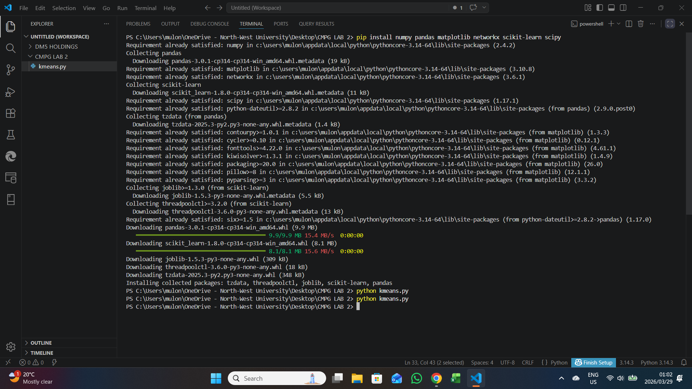

# Network Clustering and Energy Pattern Analysis with K-Means

A professional machine learning and data science project that applies K-Means clustering to a dense synthetic network. The project analyzes node communities, cluster centroids, and energy patterns using 2D and 3D visualizations.

## Project Overview

This project demonstrates how unsupervised learning can identify structure in complex network data. A synthetic dense graph is generated using a stochastic block model, node positions are transformed into overlapping communities, and K-Means clustering is applied to discover spatial groupings.

The analysis includes:

- Dense network generation
- K-Means clustering with configurable cluster counts
- Cluster centroid analysis
- Node-level energy simulation
- 2D network visualization
- 3D cluster-energy scatter plots
- Smooth 3D energy surface visualization

## Repository Structure

```text
network-clustering-analysis-kmeans/
├── assets/
│   └── screenshots/
│       ├── cmd/
│       │   └── command-output.png
│       ├── k3/
│       │   ├── Screenshot 2026-03-29 005522.png
│       │   ├── Screenshot 2026-03-29 005533.png
│       │   └── Screenshot 2026-03-29 005545.png
│       └── k7/
│           ├── Screenshot 2026-03-29 004545.png
│           ├── Screenshot 2026-03-29 004601.png
│           └── Screenshot 2026-03-29 004612.png
├── src/
│   ├── network_clustering_analysis.py
│   ├── network_clustering_k3.py
│   └── network_clustering_k7.py
├── requirements.txt
├── .gitignore
└── README.md
```

## Technologies Used

- Python
- NumPy
- Pandas
- Matplotlib
- NetworkX
- Scikit-learn
- SciPy
- K-Means Clustering
- 3D Data Visualization

## Installation

Clone the repository and install the required dependencies.

```bash
git clone https://github.com/mulondimbodi/network-clustering-analysis-kmeans.git
cd network-clustering-analysis-kmeans
pip install -r requirements.txt
```

## Usage

### Run the reusable clustering analysis

```bash
python src/network_clustering_analysis.py --clusters 7 --show
```

### Compare a smaller cluster configuration

```bash
python src/network_clustering_analysis.py --clusters 3 --show
```

### Save visualizations without opening plot windows

```bash
python src/network_clustering_analysis.py --clusters 7
```

Generated visualizations are saved in the `outputs/` directory by default.

## Original Experiment Scripts

The original K=3 and K=7 experiments are preserved in a cleaner professional structure:

```bash
python src/network_clustering_k3.py
python src/network_clustering_k7.py
```

## Results

### Command-line output



### K=3 clustering results


### K=7 clustering results


## Data Science Relevance

This project demonstrates practical data science and machine learning skills including:

- Creating reproducible synthetic network data
- Applying unsupervised learning to discover hidden structure
- Comparing cluster configurations such as K=3 and K=7
- Interpreting centroids and cluster distributions
- Visualizing high-dimensional patterns with 3D plots
- Communicating model behavior through clear visual outputs

## Future Improvements

- Add elbow method and silhouette score analysis for optimal K selection
- Export cluster summaries to CSV
- Add automated reports for cluster statistics
- Compare K-Means with DBSCAN or hierarchical clustering
- Package the analysis as a reusable notebook or dashboard

## Author

Created by Mulondi Mbodi as part of a professional Data Science and Machine Learning portfolio.
